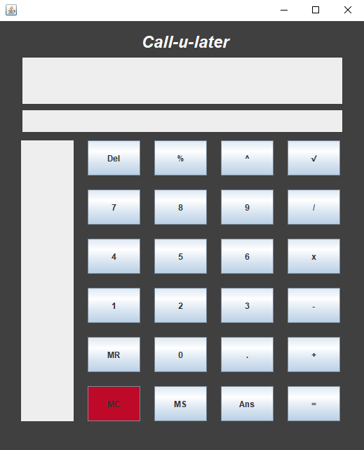

# Struktur kode
- `src/main/java/` mencakup kode program kalkulator
- `src/test/java/` mencakup kode test aplikasi kalkulator

# Cara kompile
1. install maven
2. jalankan perintah cmd `mvn compile`

# Cara run
1. install maven
2. jalankan perintah cmd `mvn exec:java`

# Screenshot aplikasi
